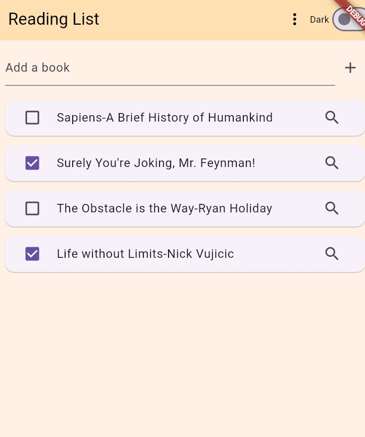
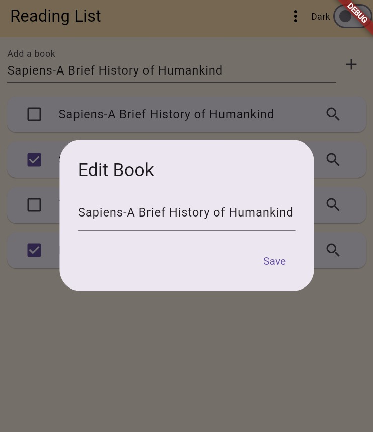

# 📚 Reading List App

A simple and elegant reading list app built with Flutter. This app helps users track books they want to read, have read, and discover more about each book with a single tap.

## ✨ Features

-  **Mark books as read/unread** via checkboxes.
-  **Local data persistence** using `SharedPreferences`.
-  **Quick search** for any book title via Google.
-  **Filter your list** by All, Active (unread), and Completed (read).
-  **Beautiful UI** with cards, spacing, and themes.
-  **Dark mode toggle**.
-  **Edit book titles** with a long press.
  

## 🚀 Getting Started

1. **Clone the repository**
   ```bash
   git clone https://github.com/yourusername/reading-list-app.git
   cd reading-list-app
    ```
2. Install dependencies
3. Run the app using flutter run


## 📸 Screenshots

### 🔆 Light Mode with Theme Toggle


### 🌙 Dark Mode and Filtered List


### ✏️ Long Press to Edit



Made with ❤️ using Flutter.
  
  
